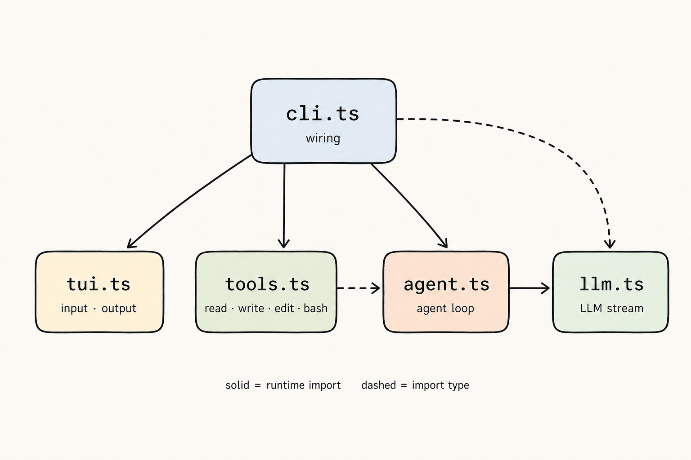
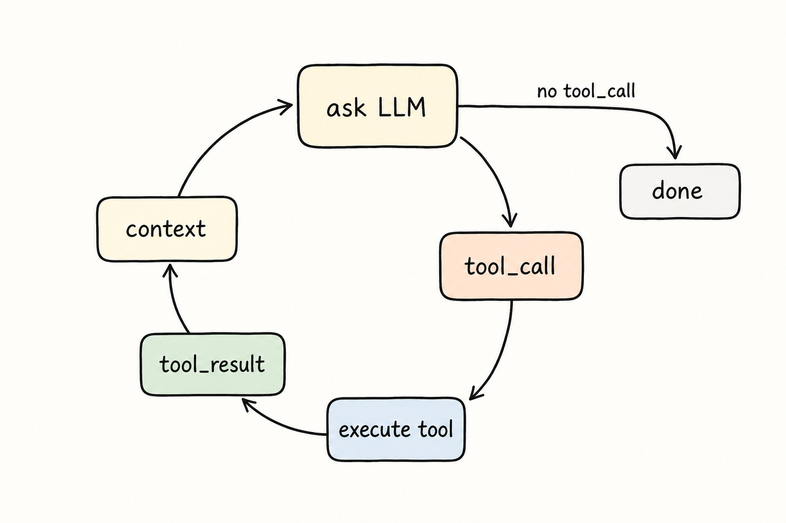
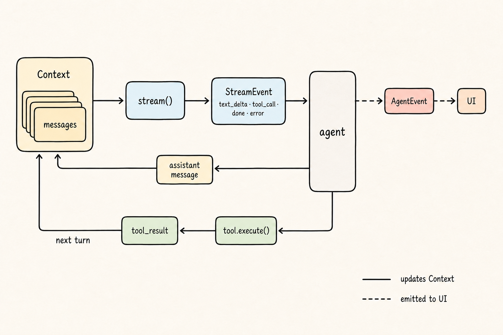
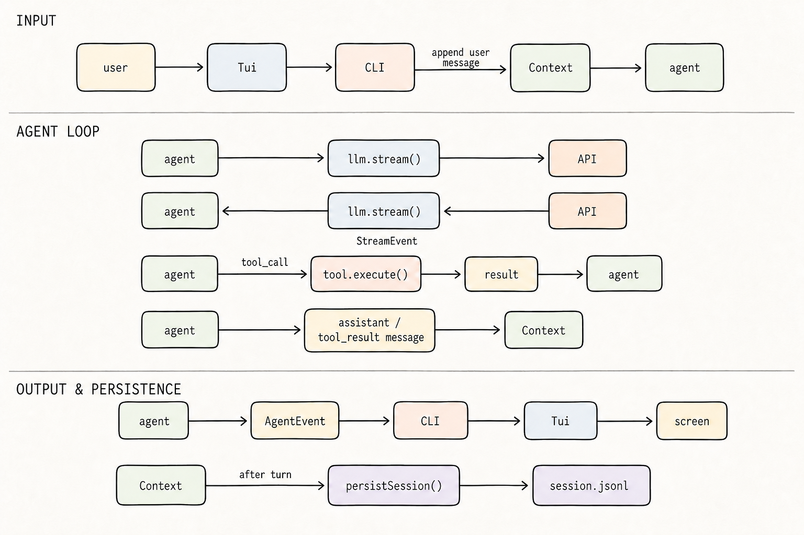

<div align="center">
  

  <h1>PI from Scratch</h1>

  <p>
    从零手写一个能读文件、改代码、执行命令的 TypeScript Coding Agent<br>
    删掉工程细节，留下核心思想 —— 5 个文件，600+ 行代码
  </p>

  <p>
    <a href="./LICENSE"></a>
    
    = 22">
    
  </p>

  <p>
    <a href="#-快速开始">快速开始</a> ·
    <a href="#-核心架构">核心架构</a> ·
    <a href="#-邮宝-youbao安全攻防-agent">邮宝 YouBao</a> ·
    <a href="https://pi-from-scratch.vercel.app">在线阅读</a>
  </p>
</div>

---

## ✨ 项目简介

本项目沿着 [pi](https://github.com/earendil-works/pi) 的数据流拆解：**需要什么、造什么**，所有组件都符合直觉。

- 📖 **一篇文章，不是一本书** —— 配套教学网站把文章和源码放在一起，阅读推进时右侧编辑器逐步补全代码，看完文章，nano-pi 的完整代码也呈现在你眼前
- 🐞 **Trace 跟踪调试** —— 可以打断点逐行过代码，逐帧理解 agent 的执行流
- 🧩 **极简内核** —— `cli` / `tui` / `agent` / `tools` / `llm` 五个模块，无黑盒、无魔法
- 🛡️ **二次开发实例** —— 在 nano-pi 内核之上构建了面向安全靶场的自主渗透 agent「邮宝 YouBao」，证明这个内核能承载真实负载

## 🧠 核心架构

五个模块，职责单一，依赖方向清晰：

<p align="center">
  
</p>

Agent 的本质是一个循环：问 LLM → 有 `tool_call` 就执行工具 → 把结果塞回上下文 → 再问，直到没有工具调用为止。

<p align="center">
  
</p>

数据在系统内的完整流动 —— 上下文、流式事件、工具执行与 UI 渲染各走各的通道：

<p align="center">
  
</p>

一次用户输入的完整往返（输入 → Agent 循环 → 输出与持久化）：

<p align="center">
  
</p>

## 🚀 快速开始

需要 **Node.js 22+** 和一个 OpenAI 兼容 API。

```bash
git clone https://github.com/Aeloria-cmd/pi-from-scratch.git
cd pi-from-scratch
npm install

export NANOPI_API_KEY=your-api-key
npm run dev          # 直接以 tsx 运行 nano-pi
```

可选环境变量：

| 变量 | 说明 | 默认值 |
| --- | --- | --- |
| `NANOPI_MODEL` | 模型名 | 视服务商而定 |
| `NANOPI_BASE_URL` | OpenAI 兼容接口地址 | `https://api.openai.com/v1` |

构建为可执行产物：

```bash
npm run build        # tsc → dist/，提供 pi-from-scratch 命令入口
```

## 🌐 本地运行教学网站

```bash
cd web
npm install
npm run dev
```

线上 trace 是预生成的静态数据，浏览网站不会发起任何模型请求。

## 🛡️ 邮宝 YouBao（安全攻防 Agent）

在原版 nano-pi 内核之上，二次开发了面向 TSec Benchmark 靶场的自主渗透 agent：

- **ReAct 双层架构** —— 外层确定性 Task Manager（选题 / 容器生命周期 / 时限 / 停滞告警），内层 LLM ReAct 循环（状态快照注入 → 推理 → 工具行动 → journal 结构化汇报）
- **三层记忆** —— `runs/<ts>/state.json`（每轮注入的当前快照）+ `rounds.jsonl`（全量可审计轮次记录）+ lessons（跨题经验）
- **统一渗透工具注册表**（`pentool`）—— 内置 ffuf / nmap / nuclei / sqlmap / whatweb（Docker 镜像携带）；agent 自写脚本可在 Web UI 一键「工具整合」，蒸馏成新的注册工具
- **Web UI 人机交互** —— 实时事件流、状态面板、停滞告警决策（继续 / 跳过）、指令注入
- **指标自采集** —— token 成本、每题耗时、得分、告警记录，自动落盘 `summary.json`

### 使用

```bash
npm install
cp config.example.json config.json   # 填入 NANOPI_API_KEY / BENCHMARK_TOKEN（也可在 Web UI 设置页配置）

npm run sec            # CLI 无人值守跑分
npm run web            # Web UI: http://localhost:8080
```

配置优先级：`config.json` > 环境变量 > 默认值。

### Docker（内置渗透工具，零安装）

```bash
docker build -t youbao .
docker run -p 8080:8080 --env-file .env \
  -v $(pwd)/runs:/app/runs \
  -v $(pwd)/skills_staging:/app/skills_staging \
  -v $(pwd)/pentools/custom:/app/pentools/custom \
  youbao
```

> 镜像构建所需的离线资产（ffuf / nuclei / nuclei-templates）已随仓库携带于 `build-assets/`，当前为 linux_arm64 版本；amd64 构建请替换其中文件。容器流量默认经宿主机 NAT 转发，宿主机连上靶场 VPN 后容器即可直达靶机。

二次开发新增代码：`src/runner.ts`（驱动器）、`src/state.ts`（状态库）、`src/sec_tools.ts`（benchmark / journal 工具）、`src/pentools.ts`（工具注册表）、`src/distill.ts`（工具蒸馏）、`src/webui.ts` + `webui/`（Web UI）。

## 📁 项目结构

```
├── src/               # nano-pi 内核 + 邮宝二次开发（agent / tools / llm / runner / pentools ...）
├── web/               # 教学网站（Next.js）：文章 + 渐进式代码编辑器 + Trace 调试
│   └── public/figures # 本文档引用的架构图
├── webui/             # 邮宝 Web UI 前端
├── pentools/          # 渗透工具注册表与自定义工具目录
├── playbooks/         # 渗透 playbook 知识库
├── experience/        # 跨题经验（lessons）
├── scripts/           # trace 生成等辅助脚本
├── build-assets/      # Docker 构建期离线资产（ffuf / nuclei / 模板）
├── docs/              # 模块与循环详解文档
└── Dockerfile         # Web UI + 跑分内核 + 渗透工具一体化镜像
```

## 🙏 致谢

- [pi](https://github.com/earendil-works/pi) —— 本项目的数据流与核心思想来源
- [SaladDay/pi-from-scratch](https://github.com/SaladDay/pi-from-scratch) —— 本项目基于其 MIT 许可的原始作品二次开发，教学网站与架构图亦出自原作
- [pi-book](https://books.antinomie.org/pi/) —— 想在做完 nano-pi 后继续深入理解 pi，这本书很值得读

## 📄 License

本项目基于 MIT 许可证发布，原始版权归 SaladDay 所有，详见 [LICENSE](LICENSE)。
