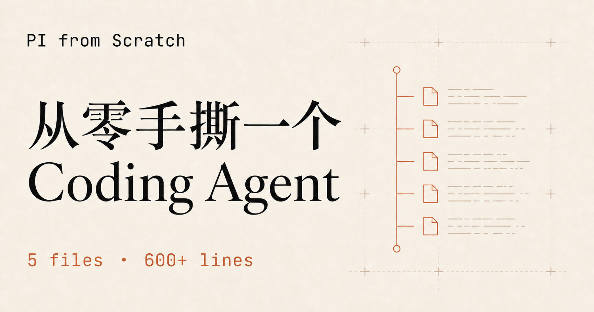

# PI from Scratch

<p align="center">
  <a href="https://pi-from-scratch.vercel.app">
    
  </a>
</p>

从零手写一个能读文件、改代码、执行命令的 TypeScript coding agent。

项目沿着 [pi](https://github.com/earendil-works/pi) 的数据流拆解，需要什么、我们造什么，所有组件都是符合直觉的。

删除 pi 的工程细节，留下 pi 的核心思想。

放轻松，这是一篇文章，不是一本书，你会很容易看懂。

网站把文章和源码放在一起。阅读推进时，右侧编辑器会逐步补全代码，当你看完的时候，nano-pi 的代码也会全部呈现在编辑器中。

同时设计了一个 Trace 跟踪，可以打断点逐行过代码，希望能帮助大家理解代码执行流。

[在线阅读 PI from Scratch](https://pi-from-scratch.vercel.app)

> 文章保留古法手敲，尽可能没有ai味，希望大家读的开心。

## 运行 nano-pi

需要 Node.js 22 或更高版本，以及一个 OpenAI 兼容 API。

```bash
npm install
export NANOPI_API_KEY=your-api-key
npm run dev
```

可选环境变量：

- `NANOPI_MODEL`：模型名
- `NANOPI_BASE_URL`：OpenAI 兼容接口地址，默认 `https://api.openai.com/v1`

线上 trace 是预先生成的静态数据，浏览网站不会发起模型请求。

## 本地运行教学网站

```bash
cd web
npm install
npm run dev
```

## Thanks

- 感谢 [OpenModel](https://www.openmodel.ai?ref=JGDNqZl8) 为本项目提供 API 测试支持。OpenModel 提供稳定可靠的 AI API 和生产级 SLA 保障，一个接口即可调用 50+ 主流模型，并可直接用于 Claude Code、Codex，以及你刚刚亲手做好的 nano-pi 😈。
- 感谢 [Cubence](https://cubence.com/signup?code=SC3M1CAH&source=ccscli) 对本项目的赞助。Cubence 自 2025 年 9 月起提供稳定高效的 API 中转服务，兼容 OpenAI 与 Anthropic 协议，可直接接入 Codex、Claude Code、pi 和 oh-my-pi 等主流编程工具。
- 感谢 [pi-book](https://books.antinomie.org/pi/) 带来的启发，为本项目从零实现 nano-pi 提供了不少思路和参考。如果你想在完成 nano-pi 后继续深入理解 pi，这本书很值得读。

## Star History

<p align="center">
  <a href="https://www.star-history.com/#SaladDay/pi-from-scratch&amp;Date">
    
  </a>
</p>

## License

[MIT](LICENSE)

---

## 邮宝 YouBao —— 安全攻防 agent(基于 nano-pi 二次开发)

在原版 nano-pi 内核之上,二次开发了一个面向 TSec Benchmark 靶场的自主渗透 agent:

- **ReAct 双层架构**:外层确定性 Task Manager(选题/容器生命周期/时限/停滞告警),内层 LLM ReAct 循环(状态快照注入 → 推理 → 工具行动 → journal 结构化汇报)。
- **三层记忆**:`runs/<ts>/state.json`(每轮注入的当前快照)+ `rounds.jsonl`(全量可审计轮次记录)+ `lessons`(跨题经验)。
- **统一渗透工具注册表**(`pentool`):内置开源工具 ffuf/nmap/nuclei/sqlmap/whatweb(Docker 镜像携带);agent 自写脚本积累在 `skills_staging/`,可在 Web UI 一键触发"工具整合"蒸馏成新的注册工具。
- **Web UI 人机交互**:实时事件流、状态面板、停滞告警决策(继续/跳过)、指令注入。
- **指标自采集**:token 成本、每题耗时、得分、告警记录,自动落盘 `summary.json`。

### 使用

```bash
npm install
cp config.example.json config.json   # 填入 NANOPI_API_KEY / BENCHMARK_TOKEN(也可用 Web UI 设置页)

npm run sec            # CLI 无人值守跑分
npm run web            # Web UI: http://localhost:8080(右上角 ⚙ 设置可直接改 config.json)
```

配置优先级:`config.json` > 环境变量 > 默认值(`.env`/shell 导出的同名变量仍可作兜底)。

### Docker(内置渗透工具,零安装)

```bash
docker build -t youbao .
docker run -p 8080:8080 --env-file .env \
  -v $(pwd)/runs:/app/runs \
  -v $(pwd)/skills_staging:/app/skills_staging \
  -v $(pwd)/pentools/custom:/app/pentools/custom \
  youbao
```

二次开发新增代码:`src/runner.ts`(驱动器)、`src/state.ts`(状态库)、`src/sec_tools.ts`(benchmark/journal 工具)、`src/pentools.ts`(工具注册表)、`src/distill.ts`(工具蒸馏)、`src/webui.ts` + `webui/`(Web UI)。

### 容器网络与靶场 VPN(实测)

OrbStack 下容器可共享宿主机网络:bridge 默认 NAT 与 `--network host` 两种模式,容器内 `ping baidu.com` 均通(已实测)。连上靶场 VPN 后,容器流量经宿主机 NAT 进 VPN 隧道,大概率可直接访问靶机。复核命令:

```bash
docker run --rm youbao curl -s --max-time 5 http://10.0.100.58   # 连 VPN 后应返回 {"status":"ok",...}
```

不通的降级路径:改用 host 网络(docker-compose.yml 注释行)→ 再不通则宿主机直跑 `npm run web`,镜像仅作交付物。
