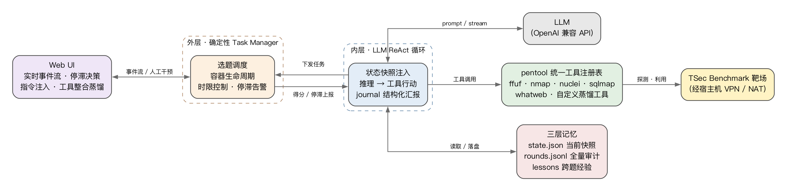
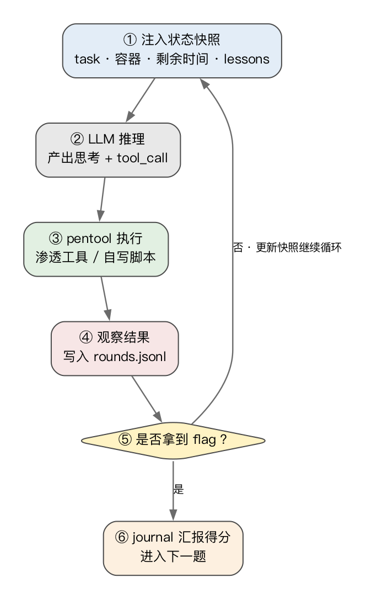

<div align="center">

  <h1>邮宝 YouBao</h1>

  

  <p>
    面向安全靶场的自主渗透 Agent —— ReAct 双层架构 · 三层记忆 · 可自我扩展的工具注册表<br>
    内核来自 600 行 TypeScript 的 nano-pi，零黑盒、可打断点逐行审计
  </p>

  <p>
    <a href="./LICENSE"></a>
    
    = 22">
    
  </p>

  <p>
    <a href="./README_EN.md">English</a>
  </p>

  <p>
    <a href="#快速开始">快速开始</a> ·
    <a href="#系统架构">系统架构</a> ·
    <a href="#核心特性">核心特性</a> ·
    <a href="#docker-部署">Docker</a>
  </p>
</div>

---

## 项目简介

邮宝 YouBao 是一个面向 **TSec Benchmark 靶场** 的自主渗透 Agent：给它一个靶机，它自己侦察、自己选工具、自己写脚本、自己总结 flag，全程可无人值守，也可以随时通过 Web UI 接管。

整个系统构建在 **nano-pi** 内核之上 —— 一个 5 个文件、600+ 行的极简 TypeScript Coding Agent（cli / tui / agent / tools / llm）。内核没有任何框架魔法，每一次 LLM 调用、每一次工具执行都是看得见的事件流，这让邮宝的每一步渗透行为都**可观测、可审计、可回放**。

## 系统架构

<p align="center">
  
</p>

外层是**确定性的 Task Manager**：选题调度、容器生命周期、时限控制、停滞告警全部由代码而非 LLM 决定，保证跑分过程稳定可控。内层是 **LLM ReAct 循环**：注入状态快照 → 推理 → 调用工具 → journal 结构化汇报。

单轮执行的完整链路：

<p align="center">
  
</p>

## 核心特性

- **ReAct 双层架构** —— 外层 Task Manager 负责确定性控制（选题 / 容器 / 时限 / 停滞告警），内层 ReAct 循环负责智能决策（状态快照注入 → 推理 → 工具行动 → journal 汇报），LLM 只做它擅长的事
- **三层记忆** —— `state.json`（每轮注入的当前快照）、`rounds.jsonl`（全量可审计轮次记录）、lessons（跨题经验沉淀），题目之间的经验可以复用
- **pentool 统一工具注册表** —— 内置 ffuf / nmap / nuclei / sqlmap / whatweb（Docker 镜像携带）；Agent 在解题过程中自写的脚本积累在 `skills_staging/`，可在 Web UI 一键「工具整合」蒸馏成新的注册工具 —— **工具集随跑分次数增长**
- **Web UI 人机协同** —— 实时事件流、状态面板、停滞告警决策（继续 / 跳过）、指令注入，随时可以从旁观者变成操作员
- **指标自采集** —— token 成本、每题耗时、得分、告警记录自动落盘 `summary.json`，跑完即可复盘
- **一体化 Docker 镜像** —— Web UI + 跑分内核 + 全套渗透工具，构建期资产离线携带，`docker build` 一条命令出镜像

## 快速开始

需要 **Node.js 22+** 和一个 OpenAI 兼容 API。

```bash
git clone https://github.com/Aeloria-cmd/youbao.git
cd youbao
npm install
cp config.example.json config.json   # 填入 NANOPI_API_KEY / BENCHMARK_TOKEN
```

两种运行模式：

```bash
npm run sec            # CLI 无人值守跑分
npm run web            # Web UI → http://localhost:8080（右上角 ⚙ 可直接改配置）
```

主要配置项（`config.json`，优先级高于环境变量）：

| 配置项 | 说明 |
| --- | --- |
| `NANOPI_API_KEY` / `NANOPI_BASE_URL` / `NANOPI_MODEL` | OpenAI 兼容 API 的密钥 / 地址 / 模型 |
| `BENCHMARK_TOKEN` / `BENCHMARK_BASE_URL` | TSec Benchmark 的凭证与地址 |
| `TASK_MINUTES` | 单题时限（分钟） |
| `STALL_ROUNDS` | 连续多少轮无进展触发停滞提醒（无人值守时注入 hint 继续，不弃题） |
| `MAX_ROUNDS` | 单题最大轮次 |
| `VPN_CHECK` | 靶场 VPN 连通性探测地址 |

## Docker 部署

```bash
docker build -t youbao .
docker run -p 8080:8080 --env-file .env \
  -v $(pwd)/runs:/app/runs \
  -v $(pwd)/skills_staging:/app/skills_staging \
  -v $(pwd)/pentools/custom:/app/pentools/custom \
  youbao
```

> 构建所需的离线资产（ffuf / nuclei / nuclei-templates）随仓库携带于 `build-assets/`，当前为 linux_arm64 版本；amd64 构建请替换其中文件。容器流量默认经宿主机 NAT 转发，宿主机连上靶场 VPN 后容器即可直达靶机。

## 项目结构

```
├── src/
│   ├── agent.ts / llm.ts / tools.ts / cli.ts / tui.ts   # nano-pi 内核（600+ 行）
│   ├── runner.ts        # 外层 Task Manager：选题 / 容器 / 时限 / 停滞告警
│   ├── state.ts         # 三层记忆：state.json / rounds.jsonl / lessons
│   ├── sec_tools.ts     # benchmark 对接与 journal 汇报工具
│   ├── pentools.ts      # pentool 统一工具注册表
│   ├── distill.ts       # 自写脚本 → 注册工具的蒸馏
│   └── webui.ts         # Web UI 服务
├── webui/               # Web UI 前端（事件流 / 状态面板 / 人工干预）
├── web/                 # nano-pi 教学网站（Next.js）：内核的图文拆解 + Trace 调试
├── pentools/            # 工具注册表数据与自定义工具目录
├── playbooks/           # 渗透 playbook 知识库
├── experience/          # 跨题经验（lessons）
├── build-assets/        # Docker 构建期离线资产
└── Dockerfile           # 一体化镜像：Web UI + 内核 + 渗透工具
```

## nano-pi 内核与教学网站

邮宝的内核 nano-pi 本身是一个独立的教学项目：沿着 [pi](https://github.com/earendil-works/pi) 的数据流拆解，需要什么、造什么。配套教学网站把文章和源码放在一起，阅读推进时右侧编辑器逐步补全代码，并支持 Trace 断点逐行跟踪。

```bash
cd web && npm install && npm run dev
```

在线阅读（原作站点）：<https://pi-from-scratch.vercel.app>

## 致谢

- [pi](https://github.com/earendil-works/pi) —— nano-pi 内核的数据流与核心思想来源
- [SaladDay/pi-from-scratch](https://github.com/SaladDay/pi-from-scratch) —— nano-pi 内核与教学网站基于其 MIT 许可的原始作品二次开发
- [pi-book](https://books.antinomie.org/pi/) —— 深入理解 pi 的延伸阅读

## License

本项目基于 MIT 许可证发布，内核与教学网站原始版权归 SaladDay 所有，详见 [LICENSE](LICENSE)。
